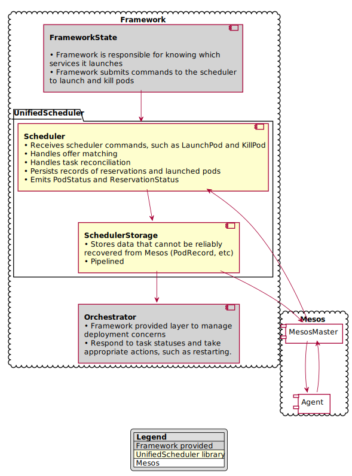
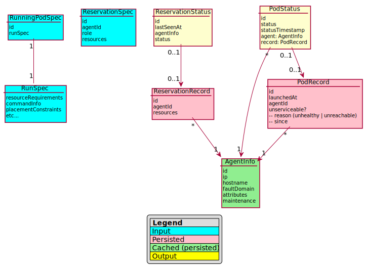
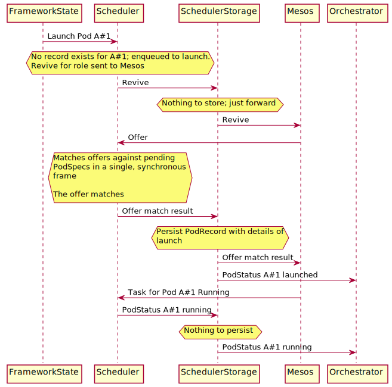

# Design

# Intent of this document

This document is intended for developers of the Unified Scheduler Interface (USI) and implementation frameworks that will use it.

# Terminology:

* **Unified Scheduler Interface (USI)**: The scheduler component described in this document; an abstraction layer that receives specifications for pods to launch, and handles low level details with Mesos.
* **Implementation Framework**: Term used to refer to a framework that uses the USI. Contains orchestration logic and persistence logic pertinent to its logic domain.
* **Scheduler command**: Sent by the implementation framework to perform actions; launch pods, kill pods, etc.
* **Pod**: A collection of one or more tasks. In the USI (and this document), we deal only with pods. Things formerly known as "apps" or "tasks" are pods with 1 task, with slightly more supported launch options (Docker, etc.).
* **Implementation Framework State**: The state of a Framework as best modeled for the Framework's needs; for example, service specifications, deployment plans, etc.
* **Orchestrator**: The orchestrator functionality of a Framework as suited for the Framework's goals, dealing with the conditional evolution of framework state.
* **RunSpec**: Framework managed data structure used to communicate a launch recipe to the USI. Covers resource requirements, networking specification, and a factory to generate a Mesos CommandInfo in order to run one or more tasks.
* **ReserveSpec**: A data structure used to communicate with the USI that some reservation to be made, resized, or destroyed. This data structure is provided by the framework.

# Overview

In this document we present a design for the USI, in order to support the creation of Frameworks with the following general design goals:

* Deterministic, even in the event of a crash.
* High scale; can handle workloads with high volume of tasks and deployments.
* Modular; frameworks can use only what it needs.
* Stays responsive under large spikes of load.
* Understandable by mortals (IE framework authors)
* Help unify integration efforts with Mesos across the variety of Frameworks in the DC/OS ecosystem.
* Provide a deterministic interface for launching pods.

In an effort to achieve these goals, the following concepts will be employed, generally, in the design of USI:

* Fast, lock-less serial processing over concurrency.
* [Event sourcing](https://martinfowler.com/eaaDev/EventSourcing.html) for the replication of state.
* External-affecting decisions are made in response to the evolution of persisted state, and not in direct response to commands themselves.
* State transitions and actions are decided upon by pure functions (scheduler has side-effects, decision to make a revive call made by a pure function which receives the current state; will make same decision every time.)

At a high-level, there are three major groups of components involved in a framework using USI, and will roughly look like the following:

# Schema

As a rough general overview, schema in USI is expected to look something like this:

# Responsibilities of USI

The USI handle as much of the Mesos-specific pod management logic, and reservation logic, without performing any orchestration functions. As an overview, the USI will perform the following jobs:

* For a given launch command and pod id, launch that pod at-most once.
    * This includes offer matching, constraint evaluation, revive behavior, etc.
* Provide a mechanism to kill pods, including periodic kill retry
* Expose the state of those pods in replicable fashion.
* Reconciles pod statuses with Mesos
* Cache (persist) and expose non-recoverable facts about pods and reservation state so that those facts are known by future recovering framework processes
* Manage reservations
* Expose agent state changes, such as "agent has begun a maintenance window and should drain".
* Expose inverse-offer changes

The USI will *not* perform these jobs:

* Automatically restarting pods
* Orchestration logic, such as rolling deployment logic
* Automatically killing unrecognized pods

## Offer Match Statistics

In order to minimize the complexity in the scheduler, the USI will expose a stream of offer match events that can be aggregated by some other component as best serves the needs of the framework. A generic and standard way to do that is left for another design document.

## Storage of Unrecoverable Facts from Mesos

There are several pieces of state that cannot be reliably recovered from Mesos under certain unreachable scenarios, or under all scenarios. In order to support deterministic behavior in the framework in the event of a crash / recovery, the USI will store these facts so that the same decisions can be made.

### The fact that we sent a task launch

The USI has launch-at-most-once guarantees. In order to guarantee this in the event of a crash, we have to store the fact that we were about to launch some task on an agent before we actually do so, since, presumably, we could failover and not see the task we launched if the agent in question were unreachable. This needs confirmation, but our understanding is that the Mesos master only stores agent info, and not task info. It should be clarified that we don't need to store the full offer, or the full response; just the time and the agentId should suffice.

The time at which we sent the task launch request is also unrecoverable, and needed as an input for rate-limited launch scenarios.

### Certain TaskStatus attributes

Mesos does not retain the first time a task was unreachable, or the first time a Mesos health check was reported unhealthy.

### Agent info

Lamentably, the agent info can be forgotten by Mesos when it is unreachable for more than `agent_ping_timeout * max_agent_ping_timeouts`. Agent info is needed as an input for certain types of offer-matching constraints, such as the Marathon `MAX_PER` constraint or `UNIQUE` constraint.

If the Agent info is forgotten, the pods may still come back later (source: I tested this myself).

### Certain facts about reservations

We'll store certain things about reservations, such as "reservation last seen".

## Unrecognized reservations and unrecognized pods

A unrecognized pod and unrecognized reservation is defined as a pod or reservation belonging to the implementation framework for which there is no persistent record (PodRecord or ReservationRecord) of it being launched.

In the case of a unrecognized pod being discovered, the USI will expose a PodStatus for the unrecognized pod to the implementation framework.

Similarly, unrecognized pods pertaining to the framework may surface. Rather than automatically kill these pods, the scheduler component will expose their status as best as it can, so that the framework can best decide what to do with them (PodStatus without a PodRecord).

Unfortunately, Mesos does not expose task grouping information, but instead reports individual task statuses. As such, unrecognized tasks will be reported as PodStatuses with a task count of 1, each.not expose this information in TaskGroup.

## Constraints Application

The scheduler component itself will provide an unopinionated, pluggable approach to the application of constraints. The USI will provide a library of predefined constraints available for use that the framework may optionally choose to use. Implementation frameworks will provide constraints to the USI via the RunSpec. The language for exposing these constraints to the end-user is left to the implementation framework.

## Storage and Message Ordering Guarantees

In order to support deterministic behavior in implementation frameworks, Message ordering will be preserved. Were it not so, we could do things such as send Mesos task statuses out of order.

Some messages require data to be persisted before we can act on them. All messages, whether they affect the persisted state or not, will be threaded through the scheduler persistence layer.

This does not imply that we store offers.

## Decoupling Scheduler Input from Implementation Framework State

An implementation framework launches pods and creates reservations by specifying RunSpecs and ReserveSpecs. However, depending on the implementation framework, different aspects of this runSpec come from the user. For example, a user may specify memory requirements, but not specify the launch command or container image (this being managed by the implementation framework deploying a deta service of some kind).

Therefore, by design USI does not persist the runSpec. It only persists the record of launching pods or reservations.

# Example Interaction Diagram

Implementation frameworks will be responsible for storing and maintaining what needs to be launched, and for handling orchestration logic; the scheduler solely handles the launching of pods (with at-least-once guarantees), and providing guarantees about which aspects of these pod states the implementation framework can get back. This has the following benefits:

* **Flexible framework schema**: Implementation frameworks can store the information about tasks to launch and schedules as it suits the framework; it is not necessary for the USI to support every different orchestration concern under the sun
* **Incremental adoption path**: Scheduler component can be integrated in to any existing framework that can emit the appropriate launch commands with runSpecs; statuses emitted by scheduler can be mapped back to entities that the implementation framework understands.
* **Generally solve the problem of deterministic orchestration**: Implementation frameworks can rely on podRecords to ensure that an instance of some service isn't doubly launched in the event of failover.

The following interaction diagram should help illustrate roughly how the scheduler component will interact with other layers.

# Questions

### How does the scheduler notify the orchestrator that an agent is going away?

AgentInfo will be exposed via the podStatus. If the agent's information is detected to be updated, an PodStatus update will be emitted for all pods pertaining to the agent with the new agent information. The orchestrator can react to this new state and begin transitioning pods off the agent in a controlled fashion.

### What about pod relaunch rate-limiting?

This is an area that needs further consideration and design. To keep the scheduler component simple and concerns separated, ideally the scheduler knows nothing about backoff delay, and another component rate-limits launch commands in-transit according to the backoff mechanism.

We may also consider if configurable per-service rate limiters are even necessary, and potentially just throttle by pod ids globally.

### What about logging?

It's anticipated that logging will be handled through the generic slf4j interface. Implementation frameworks will be responsible to provide implementations of their choosing.

### What about metrics / tracing?

This is an area that needs design, but can be done at a later date and does not affect the overall architecture of the USI.

### Benchmarking

The USI will have a simple framework test harness used to benchmark its performance, independently, to avoid performance regressions.

### How will Java consume this?

The inputs and outputs will be exposed as reactive stream [Publishers](https://www.reactive-streams.org/reactive-streams-1.0.0-javadoc/org/reactivestreams/Publisher.html) and [Subscribers](https://www.reactive-streams.org/reactive-streams-1.0.0-javadoc/org/reactivestreams/Subscriber.html). Reactive streams has been merged in to the standard library as of Java 9 and is available as a polyfill dependency for Java 8.

A Java interface will be provided for generating related data structures, interacting with constraints, reading `PodStatus` / `ReservationStatus`, etc.

### How will we react to spikes in offers received

The USI will queue a configurable number of offers. If this queue is exceeded, offers without reservations pertaining to the framework will be "quick declined", without evaluation.

### How will reservations be labeled / associated with the Framework?

Reservations for single role frameworks will be handled with labels. If needed, we will provide an pluggable strategy for detecting reservations belonging to us, and specifying them.

For multi-role reservations, we can explore using a framework-specific role (the framework ID?). This could in theory enable more efficient revives when trying to re-launch resident pods.

### How will offer revive be handled?

Offer revive will be automatically managed by the USI, as needed. However, there could be different revive policies needed (more aggressive, less aggressive, due to the framework?). Some investigation and further design is warranted here.

### How do you restart a pod?

A pod is restarted by sending a Kill command for some pod id. Then, once USI reports said pod as terminal, send a command to expunge the podRecord, and send a command to launch a new pod.

### What constraints are there on Pod / task IDs?

The USI, out of necessity, allows any valid task ID as a pod / task ID. Were it not so, frameworks could not move to the USI without killing all existing pods and reservations (since said IDs are immutable).

An option we can explore is providing modeled IDs to the USI, with one of the variants of the modeled ID being "freeform" (no associated metadata implied). Benefits of this approach could allow the USI to:

### How does the USI report schema violation errors to the framework

The Framework is responsible for sanitizing user input. Any failures to provide the USI valid input will be considered a bug.

If it does happen, one mechanism for reporting errors could be to output an erroneous podStatuses with the validation errors. This is an area open for further design.

### How does a Framework resize reservations?

Reservations will be resized by specifying a new reservation spec for the same reservation ID. The status for the reservation will be exposed via the ReservationStatus on the other end, "resizing", "resize failed", etc.

### Which version of the Mesos client will the USI use?

The USI will use the Mesos v1 client

### Is leader election a concern of the unified scheduler?

No.

### What if the framework wants to use a different data store, other than Zookeeper?

Initially, the USI will be opinionated towards storing its state in Zookeeper. Theoretically, any persistence mechanism that can preserve the order of writes would work as well. A pluggable storage module could be introduced at a future point.

### Why not just auto-kill something for which a podRecord no longer exists?

This is the behavior that Marathon has historically had, and has led to upsetting problems when the persistent state comes invalid or out-of-date (for example, a backup is restored because an upgrade failed). Preferably, how to handle unrecognized pods and reservations is up to the implementation framework.

# Relevant Resources

* [CQRS Faq](http://www.cqrs.nu/faq)
* [Scheduler Loop Design Slides](https://docs.google.com/presentation/d/11DFGBhWcEj3s7h1UT-adUbPQlea2K-PgYimySfQgb8k/edit?ouid=116111700009119528924&usp=slides_home&ths=true)
* [Martin Fowler: The LMAX Architecture](https://martinfowler.com/articles/lmax.html)
* [Lock Fee Algorithms for Ultimate Performance Slides](https://qconlondon.com/london-2012/qconlondon.com/dl/qcon-london-2012/slides/MartinThompson_and_MichaelBarker_LockFreeAlgorithmsForUltimatePerformance.pdf)
* [Reactive Manifesto](https://www.reactivemanifesto.org)
